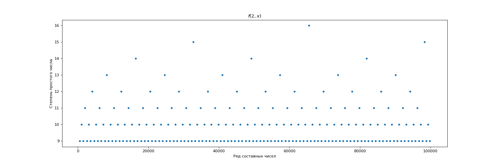
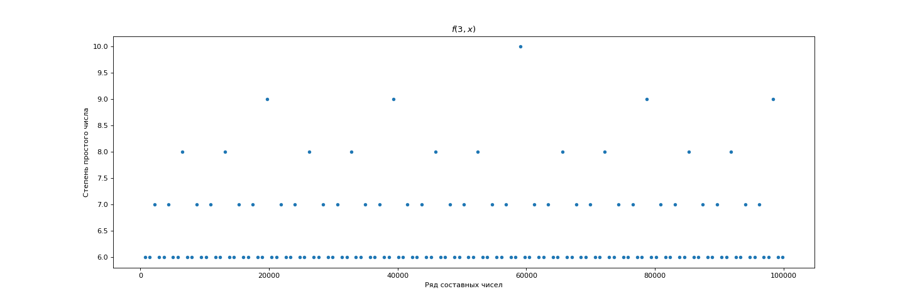
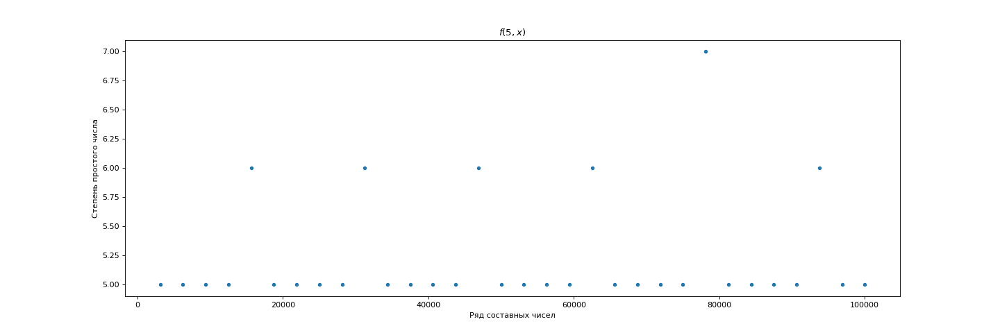
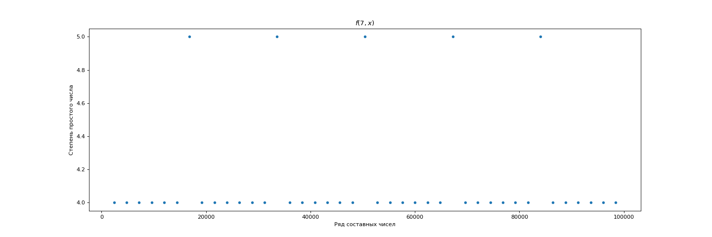
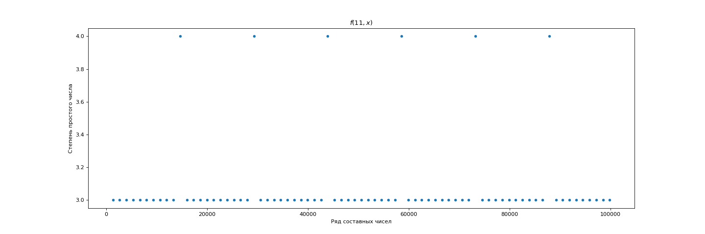
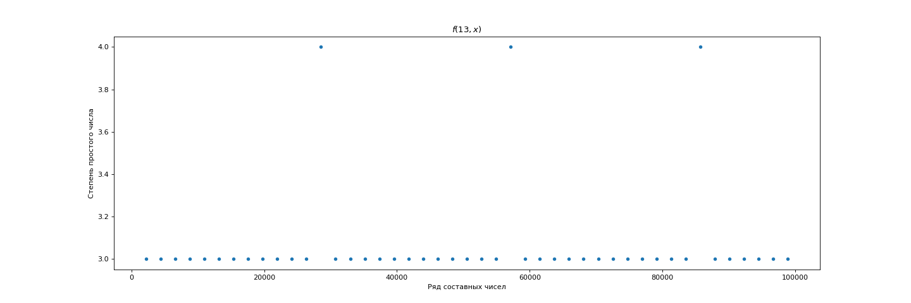

# Теория чисел

Небольшой проект для изысканий в теории чисел.

# Содержание

- [Теория чисел](#теория-чисел)
- [Содержание](#содержание)
- [Факторизация](#факторизация)
- [Библиография](#библиография)

# Факторизация

[Проект](factorization/factorization.py) демонстрирующий распределение
степеней различных простых чисел при факторизации чисел составных.

В рамках задачи получены графики функции:

$$
f(p \in \mathbb{P}, x \in \mathbb{N}) \mapsto
n \in \mathbb{N} \cup {0} :
p^{max(n)}|x
$$

где $\mathbb{P}$ -множество простых чисел.

На каждый аргумент $p$ выделен отдельный график, на абциссе которого
расположены значения $x$ а на ординате значения $n$.

Для удобства воспрятия из графиков удалены точки со слишком большой
плотностью.

# Библиография

* [Теория чисел][1] *Ситникова В.М.*

[1]: http://elib.cspu.ru/xmlui/bitstream/handle/123456789/623/Ситников%20Теория%20чисел%20А5.pdf
